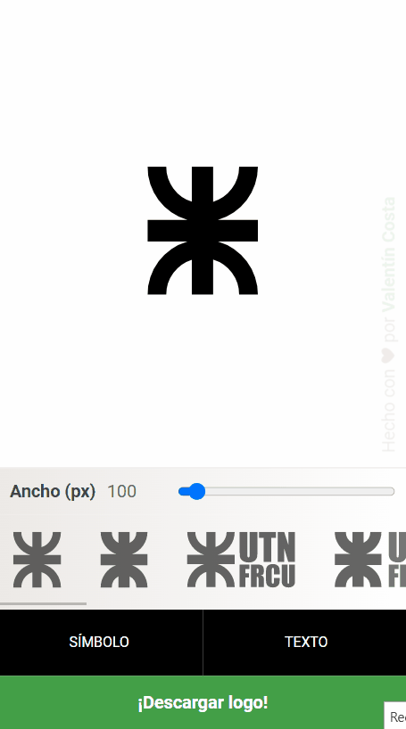

# UTNator

Generate the UTN FRCU's logo with your preferred colors.

[utnator.vercel.app](https://utnator.vercel.app)


## 📜 Description

UTNator is a UTN FRCU's logo generator.

You can use it to design the cover page for your next project, essay, or paper.

Use different combinations of colors to match your preferred style.

UTNator is built with HTML, CSS and JS.

## 🤝 Contributing

Contributions, issues and feature requests are welcome. Feel free to check [issues](https://github.com/valentincostam/utnator/issues) page if you want to contribute.

And, of course, you can help with code:

1. [Fork this repository and clone your fork](https://docs.github.com/en/get-started/quickstart/fork-a-repo).

    ```
    git clone https://github.com/<your-username>/utnator.git
    ```

2. Create your feature/fix branch.

    ```
    git checkout -b my-new-feature
    ```

3. Commit your changes.

    ```
    git commit -am 'Add some feature'
    ```

4. Push to the branch.

    ```
    git push origin my-new-feature
    ```

5. Submit a [pull request](https://github.com/valentincostam/utnator/pulls).

## 📝 License

[MIT](https://github.com/valentincostam/utnator/blob/master/LICENSE) © [Valentín Costa](https://twitter.com/valentincostam)
